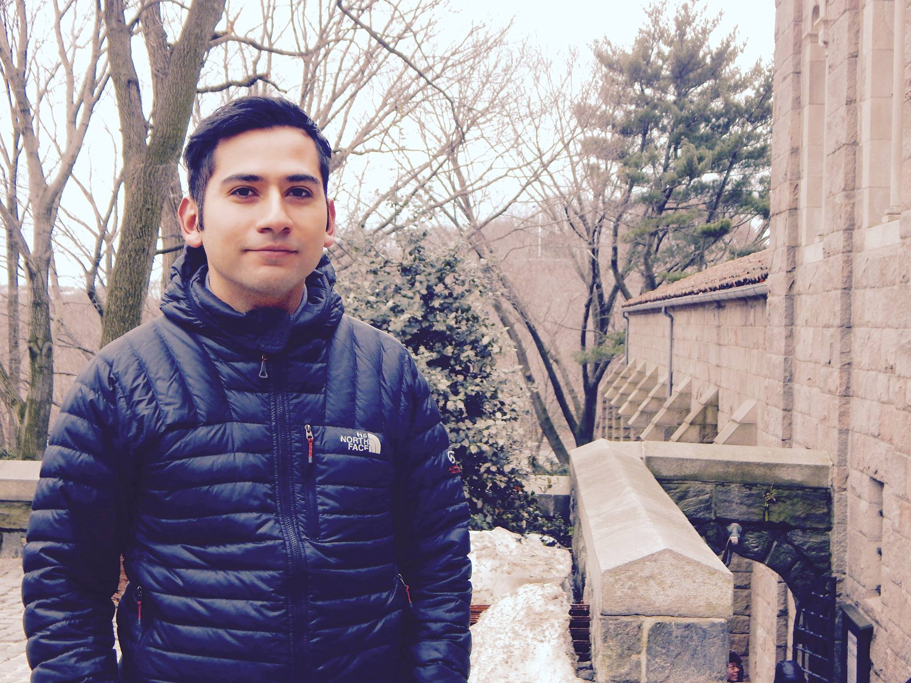
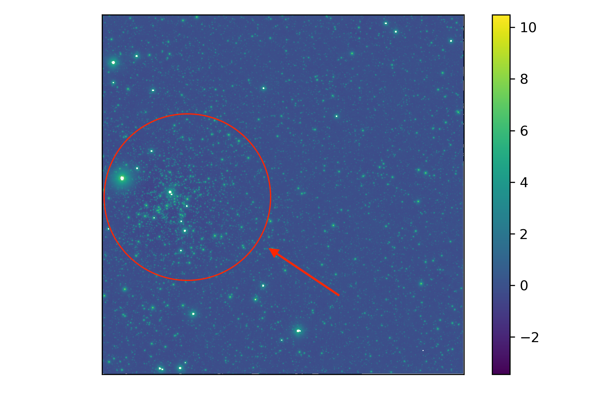
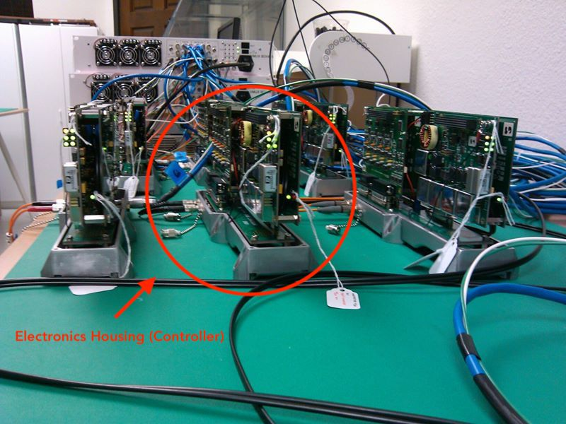
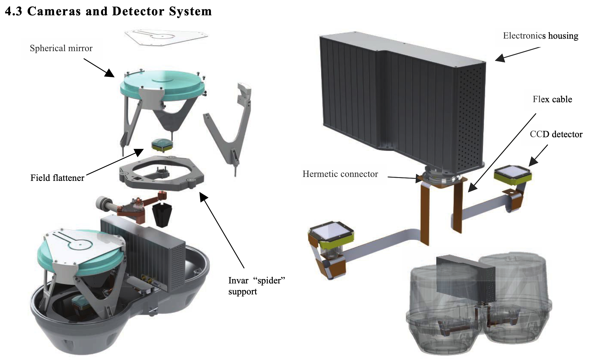
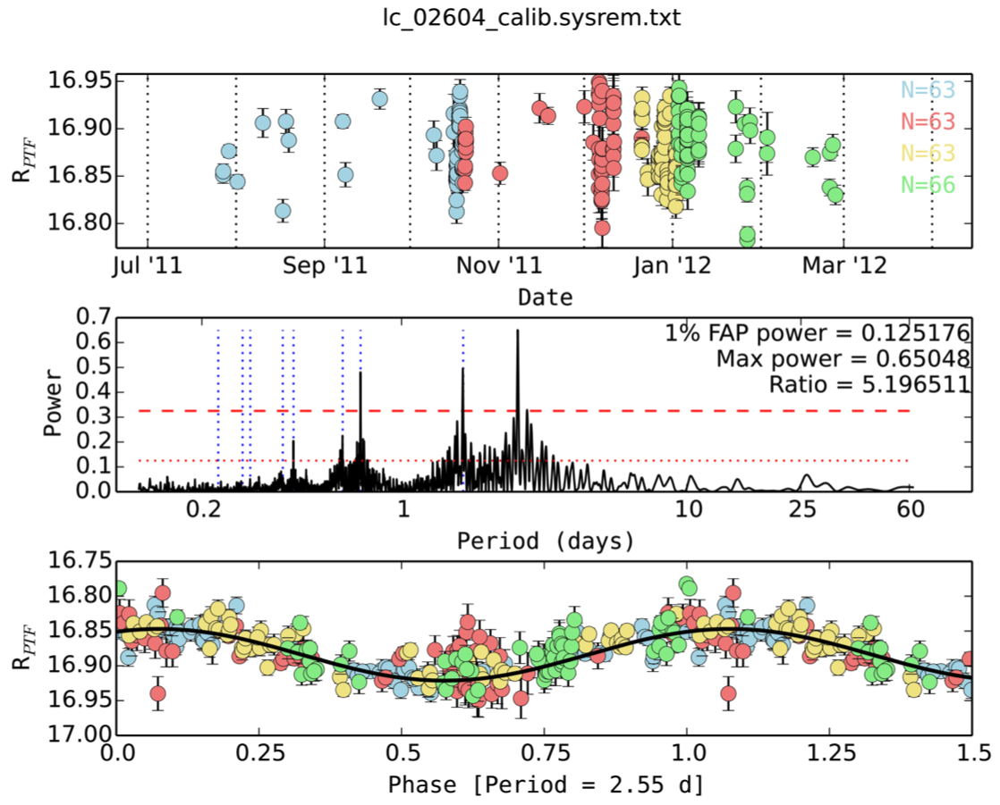
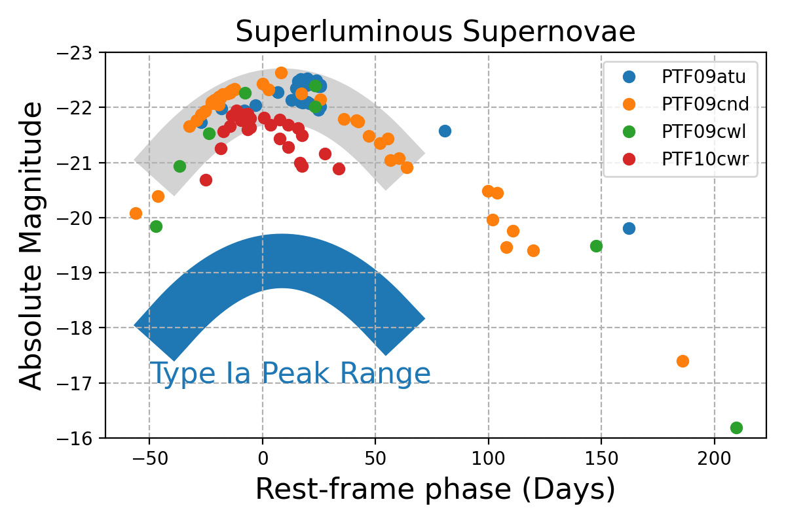
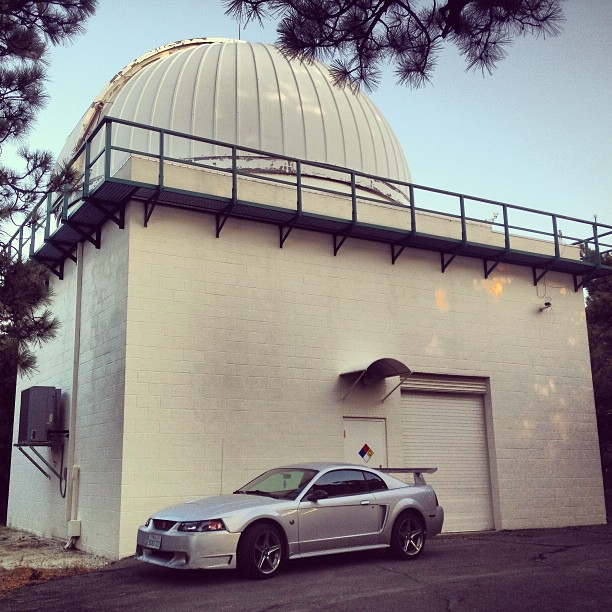
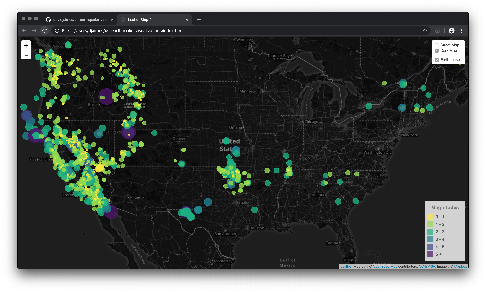

import { Alert } from 'react-bootstrap';

<h1 align="center" style={{marginTop: "2em", marginBottom: "1em"}}>Husband. Scientist. Trail Runner.</h1>


<p style={{fontSize: '12px'}}><b>Photo Credit:</b> Naxiely Cedano; <b>Location:</b> The Cloisters, NYC.</p>

<br/>

## About me
I'm a [data scientist](https://en.wikipedia.org/wiki/Data_science) with a bachelor's in astronomy and a certificate in data science and visualization from UC San Diego.

I possess: 

- Exceptional analytical and conceptual thinking skills that drive an unquenchable, technical curiosity to find truths embedded in any dataset.
- Senior-level experience using statistical modules and data visualization libraries.

I have a passion for:

- Utilizing a scientific mindset when developing incredibly fast, efficient, and insightful solutions at high-performing companies where modern analysis toolkits are conventional.
- Understanding and teaching best practices when developing applications that directly affects the operational execution of any organization.

<br/>

## Fun Question to Ask
How much does a teaspoon of neutron star matter weight? Please answer in of number of elephants.

```python
from astropy import units as u
import numpy as np

elephant_mass = 5900 * u.kg  # about 13,000 lbs
neutron_mass = 1.4 * u.solMass  # about mass of Sun
neutron_volume = (4/3) * np.pi * pow(10 * u.km, 3)  # 10 km radius
teaspoon_volume = 5 * pow(u.cm, 3)

neutron_teaspoon_mass = neutron_mass * teaspoon_volume / neutron_volume
N_elephants = (neutron_teaspoon_mass / elephant_mass).decompose()
print(f'{int(N_elephants):,} elephants!')
```

<br/>

And, the answer is ...

```python
563,200,886 elephants!
```

<br/>

## Short Biography

I received my B.S. in astronomy from San Diego State University (SDSU) in 2013. At SDSU, my research with Eric L. Sandquist focused on investigating the age of the old open cluster, NGC 6819.

<br/>


<p style={{fontSize: '12px'}}><b>Target:</b> NGC 6819; <b>Source:</b> mast.stsci.edu</p>

<br/>

I also worked for Astronomical Research Cameras, assembling controllers and multiplexors for the Visible Integral Field Replicable Unit Spectrographs (VIRUS) used by the Hobby-Eberly Telescope Dark Energy Experiment project at the University of Texas, Austin.

<br/>



<p style={{fontSize: '12px'}}><b>Figure:</b> Electronics housing; <b>Source:</b> hetdex.org</p>

<br/>

During the Bridge to the Ph.D. Program, I worked with Marcel A. Agüeros on the young open cluster, Alpha Persei. The new rotation periods that I measured for stars in this cluster would be used to calibrate and anchor the relationship between stellar age and rotation.

<br/>


<p style={{fontSize: '12px'}}><b>Figure Credit:</b> David Jaimes; <b>Location:</b> Pupin, Columbia University</p>

<br/>

Thanks to the efforts of the Bridge to the Ph.D. Program, I moved to California and was pursuing an M.S. in astronomy at SDSU. I was working with Robert W. Quimby, Director of the Mount Laguna Observatory, to classify spectra (usually supernovae) taken with the 60-inch telescope at Palomar Mountain.

<br/>


<p style={{fontSize: '12px'}}><b>Figure Credit:</b> David Jaimes; <b>Location:</b> San Diego State Univeristy</p>

<br/>

In 2017, I took a leave of absence from SDSU and put my thesis project on hold to help my wife immigrate to the United States. I plan to finish my graduate studies at some point in the future when the opportunity arises. For now, I am pursuing a career in data science, data enigineering, data analysis, or software enigineering.

<br/>


<p style={{fontSize: '12px'}}><b>Photo Credit:</b> David Jaimes; <b>Location:</b> Mount Laguna Observatory</p>

<br/>

<br/>


<p style={{fontSize: '12px'}}><b>Image Credit:</b> David Jaimes</p>

<br/>

## Books

Books currently reading.

Title | Author
:--- | :----
Hyperion | Dan Simmons
Dark Matter and the Dinosaurs | Lisa Randall
Cthulhu Mythos Tales | H.P. Lovecraft
Heart of Darkness | Jeremiah P. Ostriker and Simon Mitton
Build Your Running Body | Pete Magill, Thomas Schwartz, and Melissa Breyer
Legado Astronomico | J. Daniel Flores Guitierrez, Margarita Rosado Solis, y Jose Franco Lopez
Python for Data Analysis: 2nd Edition | Wes McKinney
Python Data Science Handbook | Jake VanderPlas
