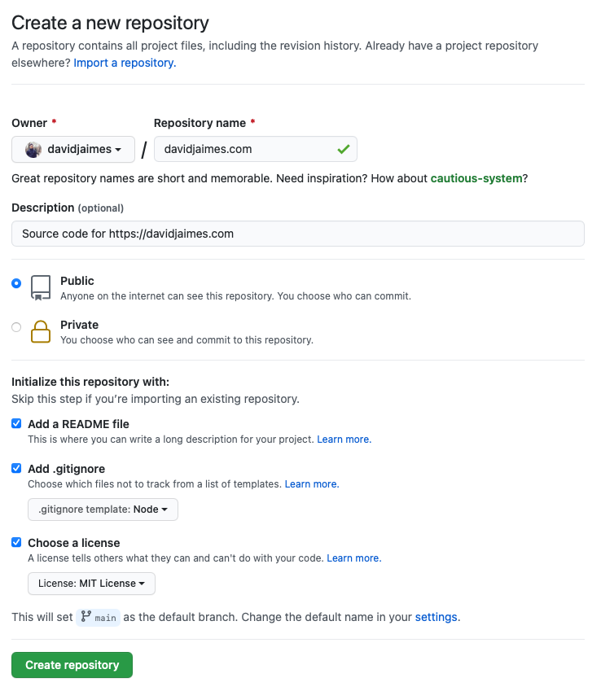
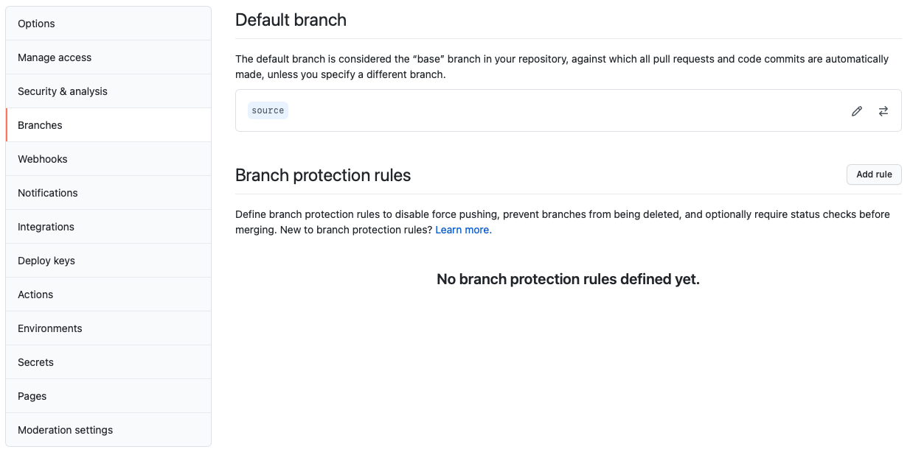
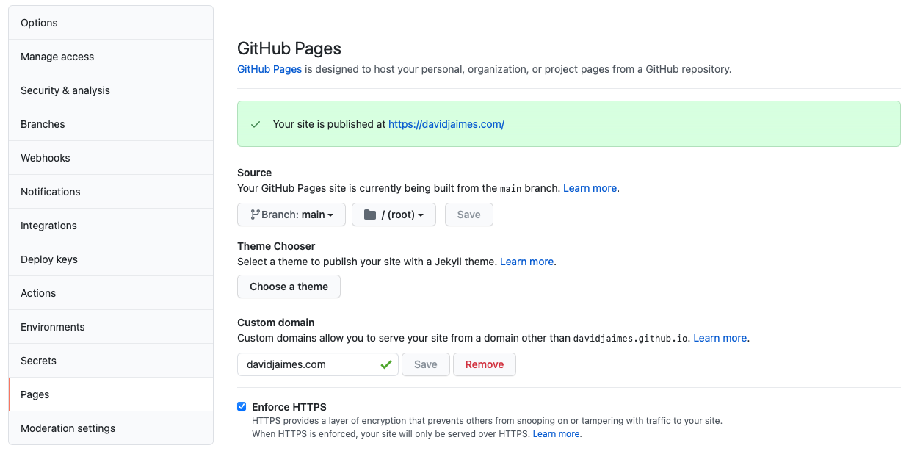

<h1 align="center" style={{marginTop: "2em"}}>GatsbyJS Configuration</h1>

<br/><br/>

Gatsby is a free and open source framework based on React that helps developers build blazing fast **websites** and **apps**.

<br/><br/><br/>

## macOS Setup Without a Gatsby New Command

<br/>

Install Xcode Command line tools:

```bash
xcode-select --install
```

<br/>

Install **Node** with **Homebrew**:

```bash
brew install node
```

<br/>

Install the Gatsby CLI (Command Line Interface):

```bash
npm install -g gatsby-cli
```

<br/><br/><br/>

## Prepare Your Environment

<br/>

Create new repository in GitHub:



<br/>

Set up a new project folder:

```bash
git clone https://github.com/davidjaimes/davidjaimes.com.git
cd davidjaimes.com
```

<br/>

Create new branch with git:

```bash
git checkout -b source
```

<br/>

Next, you’ll need to set up **npm** (create package.json file) within your project:

```bash
npm init
```

<br/>

This is my **package.json** file:

```js
{
  "name": "davidjaimes.com",
  "version": "1.0.0",
  "description": "Source code for https://davidjaimes.com",
  "main": "index.jsx",
  "scripts": {
    "test": "echo \"Error: no test specified\" && exit 1"
  },
  "repository": {
    "type": "git",
    "url": "git+https://github.com/davidjaimes/davidjaimes.com.git"
  },
  "author": "David Jaimes",
  "license": "MIT",
  "bugs": {
    "url": "https://github.com/davidjaimes/davidjaimes.com/issues"
  },
  "homepage": "https://github.com/davidjaimes/davidjaimes.com#readme"
}
```

<br/>

Commit your changes:

```bash
git add .
git comment -m "add package.json"
git push --set-upstream origin source
```

<br/><br/><br/>

## Setup GitHub Pages

<br/>

Go to GitHub repository and set **source** branch as default:



<br/>

Then, setup GitHub Pages with custom url and branch chosen is **main**:



<br/>

Install npm gh-pages:

```bash
npm install gh-pages --save-dev
```

<br/>

Install Gatsby as a dependency:

```bash
npm install gatsby react react-dom
```

<br/>

Deploy and publish to **main** branch in repo:

```bash
npm run deploy
```