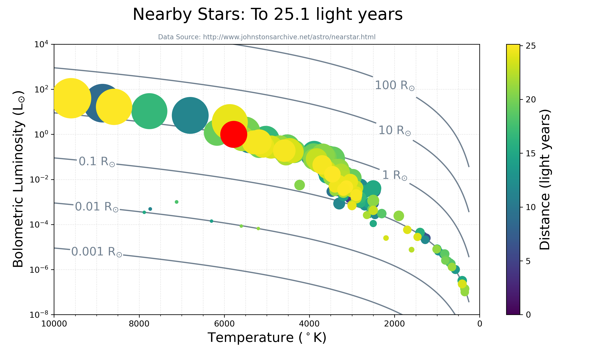

<h1 align="center" style={{marginTop: "2em"}}>Nearby Stars to 25.1 Light Years</h1>

<p align="center">Data Source: <a href="http://www.johnstonsarchive.net/astro/nearstar.html">Robert Johnston's Archive</a></p>

<br/><br/>

## Classifying Stars

Luminosity and surface temperature (color) are two properties of stars we can measure. Using these two characteristics has proved extraordinarily effective un understanding the properties of stars-the Hertzsprung Russell (HR) diagram. The Stefan-Boltzmann equation applied to a black body gives the value for luminosity for a black body, an idealized object which is perfectly opaque and non reflecting:

$$
L = \sigma_B A T^4 = 4 \pi \sigma_B R^2 T_{eff}^4
$$

<br/>

## Data Information

This list includes known stars, brown dwarfs, and planets within 25.1 light years of the Sun. Sources are listed at the end of the page. Some values are estimated.

Counts of listed objects include:

- 175 systems: 133 single, 30 double, 9 triple, 2 quadruple, and 1 sextuple.
-177 stars: 168 main sequence, 9 white dwarfs.
- 54 brown dwarfs (many with very uncertain distances).
- 73 planets in 25 systems.
- 63 planets beyond our solar system: 10 systems with one known planet each; 8 systems with 2-3 known planets each; 5 systems with 6-7 known planets each; 1 free-floating planet.
- total detected mass of 76.2 M$_{\odot}$--average density of ~1.2 M$_{Jup}$ per cubic light year.

<br/>

## Read Fixed-Width Formatted File

Relationship between Solar, Jupiter, and Earth radii:

$$
1 R_{\odot} = 9.9604 R_{Jup} = 109.18 R_{\oplus}
$$

<br/>

```python
import pandas as pd


# Read fixed-width formatted (fwf) data file.
widths = [28, 12, 11, 8, 8, 9, 9, 10, 10, 9, 5, 11, 6, 9, 14, 10, 7, 6, 8, 7,
    8, 9, 9, 9, 6]
columns = ['DIST', 'Mv', 'BOL-LUM', 'RADIUS', 'Unnamed: 19', 'Teff']
df = pd.read_fwf('nearby-stars.txt', widths=widths, usecols=columns)
df = df.drop([0, 1]).reset_index(drop=True)
df = df.rename(columns={'Unnamed: 19': 'Radunit'})

# Convert to number from string.
columns = ['Teff', 'Mv', 'DIST', 'RADIUS', 'BOL-LUM']
for col in columns:
    df[col] = df[col].str.replace(r'[a-zA-Z]', '', regex=True)
    df[col] = pd.to_numeric(df[col], errors='coerce')

# Radius conversion from Sun, Jupiter, and Earth.
w = df['Radunit'] == 'Rj'
df.loc[w, 'RADIUS'] /= 9.9604
w = df['Radunit'] == 'Re'
df.loc[w, 'RADIUS'] /= 109.18

# Temperature-Luminosity Relation lines.
t = np.linspace(250, 1e4, 1000) * u.K
r = np.logspace(-3, 3, 7) * u.R_sun
T, R = np.meshgrid(t, r)
coef = (4 * np.pi * c.sigma_sb).to('W K-4 Rsun-2')
L = (coef * pow(R, 2) * pow(T, 4)).to('Lsun')

# Plot Temperature-Luminosity Relation lines
plt.figure(figsize=(10, 6))
CS = plt.contour(T, L, R, levels=r, colors='slategrey', linestyles='-',
    zorder=2)
manual = [(9e3, 1e-5), (9e3, 1e-3), (9e3, 1e-1), (2e3, 1e-1), (2e3, 1e1),
    (2e3, 1e3)]
plt.clabel(CS, fmt = r'%.3g R$_{\odot}$', inline=True, manual=manual,
    fontsize=14)

# Plot data and contour lines
cb = plt.scatter(df['Teff'], df['BOL-LUM'], s=1e3*df['RADIUS'], c=df['DIST'],
	zorder=3, alpha=1, cmap='viridis')
plt.scatter(5778, 1, s=1e3, c='red', label='Sun', zorder=4)
plt.xlabel(r'Temperature ($^\circ$K)', size=16)
plt.ylabel(r'Bolometric Luminosity (L$_{\odot}$)', size=16)
plt.suptitle('Nearby Stars: To 25.1 light years', size=20, x=0.45)
plt.title('Data Source: http://www.johnstonsarchive.net/astro/nearstar.html',
    size=8, color='slategrey')

# Plot options
plt.grid(zorder=1, ls=':', color='gainsboro', which='both')
plt.gca().set_xticks(np.arange(0, 10500, 500), minor=True)
plt.xlim(1e4, 0)
plt.ylim(1e-8, 1e4)
plt.yscale('log')
plt.colorbar(cb).set_label(label='Distance (light years)', size=16)
plt.tight_layout()
plt.savefig('nearby-stars.png', dpi=300, transparent=True)
```

<br/>

